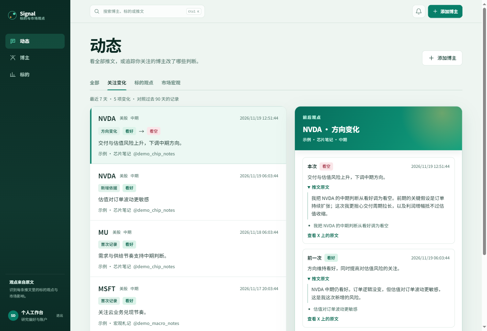

# Signal · 财经博主观点追踪

跟踪你关注的 X 博主，从原文、引用和配图里提取逐标的观点。看清他现在怎么判断、与上次有什么变化，以及判断依据在哪里。

**适合已经有固定信息源、想减少刷时间线的研究者。** 支持 A 股、港股、美股、原油、黄金和加密货币。没有具体标的的宏观判断单独展示。

[功能与界面](#从一条推文开始) · [本地启动](#本地启动) · [验证与部署](#验证与部署)

## 从一条推文开始

### 关注变化

打开「动态 → 关注变化」，左侧是自己关注的博主近期首次记录、方向变化或原文新增依据，右侧对照本次和前一次的方向、时间、原文摘录和可用配图。短期看空与长期看好不视为反转；不同作者、转载、引用和直接推广也不会混进同一条观点历史。



### 全部动态

保留完整时间线。可按「标的观点」或「市场宏观」在服务端筛选；点击推文顶部的分析入口，即可查看标的方向、依据、风险、预测和引用来源。未分析或无明确投资观点的推文仍保留。


### 博主与标的

在「博主」输入 X Handle 添加信息源，管理关注或采集状态。在博主页回顾其观点；在标的页对比不同博主的有效观点和仅供参考的提及。明确且可验证的预测独立进入复核，观点不自动变成预测成绩。


以上截图来自本版实际运行的应用，使用独立测试库的虚构演示数据。

## 工作流程

1. **采集原文。** 保存正文、作者、时间、长文、引用关系；可归档图片。原文入库后即可生成检索索引，分析不影响原文查看。
2. **逐标的分析。** LangGraph 先分类，再提取标的和宏观观点，同时识别风险；图片证据参与分析。非金融内容写入明确的跳过结果。
3. **复核与业务校验。** 主模型处理分类、提取、风险，复核模型检查歧义或高价值内容，仲裁模型解决关键分歧。业务层处理标的身份、作者归属、商业关联和下游资格。
4. **发布和验证。** 结果写入 PostgreSQL，异步生成分析索引和情报。只有满足目标、期限及资格条件的预测进入验证。ES 与 Milvus 是可重建索引，不是原文的唯一副本。

| 模块 | 实现 |
| --- | --- |
| 页面与接口 | Next.js 15、FastAPI |
| 异步任务 | Celery、Redis、PostgreSQL Outbox；分开处理采集、文本、图片和索引 |
| 模型 | OpenAI Chat Completions 用于文本和图片；DashScope 用于嵌入与重排 |
| 数据与搜索 | PostgreSQL；可选对象存储、Elasticsearch 8/IK、Milvus 或 Chroma |

## 本地启动

准备 Python 3.12+、[`uv`](https://docs.astral.sh/uv/)、Node.js、PostgreSQL 和 Redis。先创建 PostgreSQL 数据库。

```bash
git clone https://github.com/arjun-go-go/finance-tweet-analyzer.git
cd finance-tweet-analyzer
cp .env.example .env
uv sync
uv run alembic upgrade head
```

PowerShell 中用 `Copy-Item .env.example .env`。按 [配置模板](.env.example) 填写实际值：

| 必需或按功能启用 | 配置 |
| --- | --- |
| 数据库和任务 | `DATABASE_URL`（使用 `postgresql+psycopg://`）、`REDIS_URL`、`CELERY_BROKER_URL`、`CELERY_RESULT_BACKEND` |
| 登录 | `JWT_SECRET_KEY`、`CORS_ALLOWED_ORIGINS`；用 `ADMIN_USER_IDS` 授权管理员 |
| 文本和图像分析 | `OPENAI_API_KEY`、`OPENAI_BASE_URL`、`SIGNAL_MODEL`、`REVIEW_MODEL`、`REPORT_MODEL`、`VISION_MODEL` |
| X 采集 | 启用 `TWITTER_FETCH_ENABLED` 前配置合法的数据访问方式；目前采集器的限制见 [公开发布检查](docs/x-source-readiness.md) |
| 图片、索引与行情 | 可配置 MinIO、`RAG_KEYWORD_BACKEND`、`VECTOR_BACKEND`、`DASHSCOPE_API_KEY` 和各行情 Provider |

在项目根目录分别启动 API、后台 Worker 和定时任务：

```bash
uv run uvicorn app.main:app --reload --port 8000
uv run celery -A app.celery_app worker -Q analysis,prediction,ingest,vision,embed,default -l info
uv run celery -A app.celery_app beat -l info
```

在 Windows 上给 Worker 加 `--pool=solo`。如需修改 API 地址，在前端配置 `NEXT_PUBLIC_API_URL`，并将前端 Origin 加入后端 CORS 列表。

```bash
cd frontend
npm ci
npm run dev
```

访问 [工作台](http://localhost:3000) 或查看 [API 文档](http://localhost:8000/docs)。

## 验证与部署

后端测试必须使用**独立的 PostgreSQL 数据库**；测试会创建和清理表。将 `TEST_DATABASE_URL` 和测试进程内的 `DATABASE_URL` 指向同一个以 `_test` 结尾的数据库，再执行：

```bash
uv run pytest -q tests/
cd frontend
npm run lint
npm run build
```

部署新版本时先备份数据库并执行 `uv run alembic upgrade head`。Linux 可使用 [systemd 单元](deploy/systemd) 和 [管理脚本](scripts/manage.sh)：

```bash
bash scripts/install-user-systemd.sh
bash scripts/manage.sh start
bash scripts/manage.sh status
bash scripts/manage.sh health
```

升级会保留现有分析开关状态。管理员可从「个人工作台（设置）→ 系统运行监控」暂停模型、仅恢复新入库内容，或明确选择「恢复并补跑」。暂停分析期间，采集、原文入库和图片归档继续。运行监控分别展示暂缓的历史任务和最近 24 小时文本模型用量。

## 数据来源说明

公开发布前，先验证数据来源的授权、长文和媒体覆盖、内容撤除和实际价格，见 [X 数据来源公开发布检查](docs/x-source-readiness.md)。采集配置、访问令牌和业务原文不要提交到仓库。

Signal 用于整理和回看公开观点，分析和验证结果仅供研究参考。
